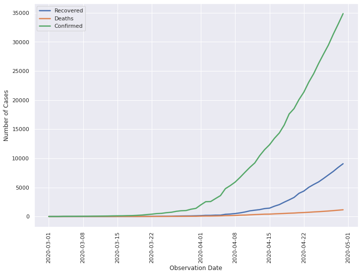

        
         
        <h2 align="center"> 2020's Pandemic: March Vs December</h2>
         
        
2020 has won the award for the best worst year ever and it was only fitting to analyse the crucial component of this success : the CoronaVirus. We compared how the coronavirus was received in India in March 2020 vs it's status at present in December 2020, in terms of both, cases and sentiments.
        

 
  
  <h3>Editor's Note</h3>
  We free our data from all possible bias before analysis but there are some biases like that of opinion which can't be removed and hence, may affect the results.
  Our predictions are made by the help of mathematical formulas and tend to have a certain amount of accuracy .They must not be perceived as the absolute truth.
  
  <h3> Results </h3>
  
  <h4> Cases in March </h4>
   
  
   
  From the period of March to April , the cases were on a steady rise. The outbreak seems to have happened between 15 to 22 March 2020,that is, before we went m      into a lockdown.
   
  <h4> Cases in December </h4>
    
  
   
  As of 5th December , the recovery and confirmed cases can be seen trying to close the gap between them. Deaths (here, in comparision) have dropped by a huge margin.
   
  
  <h4> Tweet Analysis : March </h4>
    
  
   
    
  
   
  We performed sentiment analysis on tweets in March. The word cloud on the top represents the negative sentiment word cloud. Tweetizens described the virus as nasty flu, flaky and other words as shown in the cloud. The bottom is the positive word cloud. Seems like everybody was calling family and urging people to stay at home.
   
  
  <h4> Tweet Analysis : December </h4>
   
  
   
    
  
   
  We then did the same with December. The word cloud on the top represents the negative sentiment word cloud. Tweetizens have got sick of both the virus and trump.Our sentiment analyser felt your despair as you longed for the vaccine and put that keyword in the negative cloud. The bottom is the positive word cloud.  This word cloud seemed to be filled with  holiday spirits.
   
  
  <h3> Conclusion </h3>
  Culmination of 2020 brings the news of cases going down , vaccine trials and that of the mutating virus(COVID19). As many countries seal their borders and give out guidelines , we humbly request you to  follow them because as Amitabh Bacchan says on your calls ," COVID19 abhi khatam nhi hua hai". We don't know what the new strain of virus brings for us and we can't even predict it at the moment(no public data 😖). So, stay safe and follow the guidelines.
  
   
  <h3> Contributors </h3>
  <ul>
  <li> Analysis & Words: <a href="https://github.com/tarushi98"> Tarushi Pathak </a> </li>
        <li> Editor:<a href="https://github.com/Purbasha33">Purbasha Pan </a> </li>
  </ul>

  <h3> Article Link : Yet to be Uploaded </h3>
